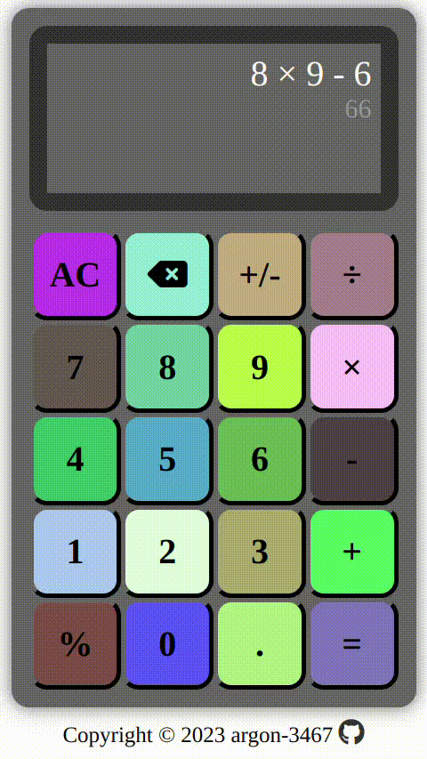

# Calculator

Basic Airthmatic (Add, subtract, multiply, divide and remainder)  

## Calculate something [here](https://argon-3467.github.io/odin-projects/calculator/)

## Understanding Error Messages

"अरे करना क्या चाहते हो?" => Invalid Expression (syntax Error)  
"अधिकतम अंक सीमा 15 है" => Digit limit is 15 (Floating point Error)  
"उत्तर 15 अंकों से बड़ा है" => Answer can't be calcualated accurety (Floating point Error)  
"शून्य से भाग नहीं किया जा सकता" => Divde by zero error (syntax Error)

## Demo Video

