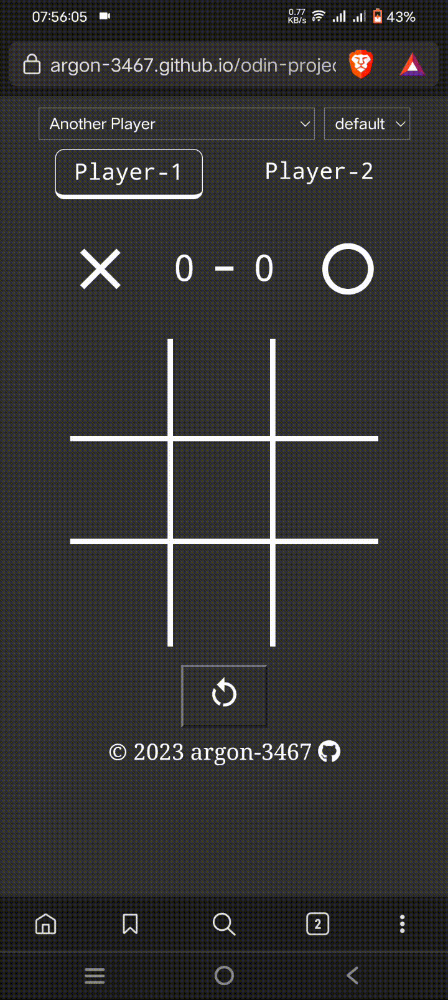

# Tic-Tac-Toe

## How to play [wikipedia](https://en.wikipedia.org/wiki/Tic-tac-toe)

## Play [here](https://argon-3467.github.io/odin-projects/tic-tac-toe/)

## To do

- [x] Add theme selector(System default, Dark and Light)
- [x] Add Player Vs Player Mode
- [ ] Implement Minimax algorithm

## Demo Video

